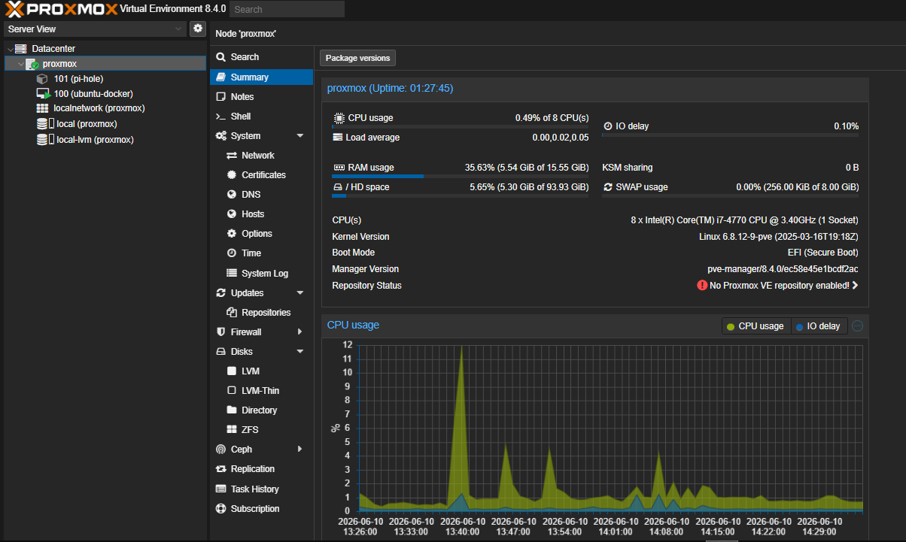
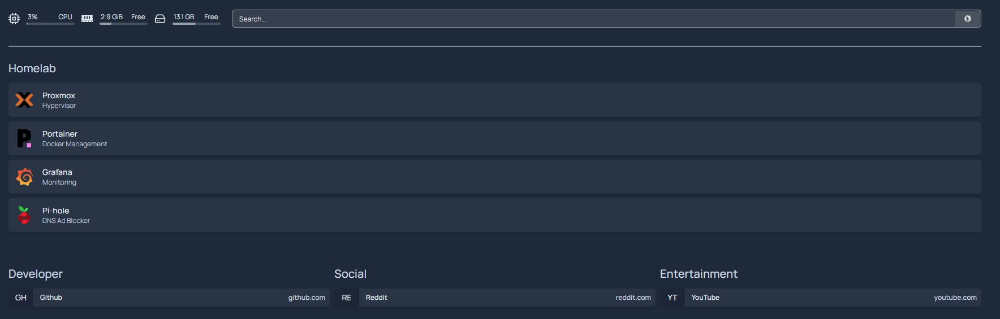
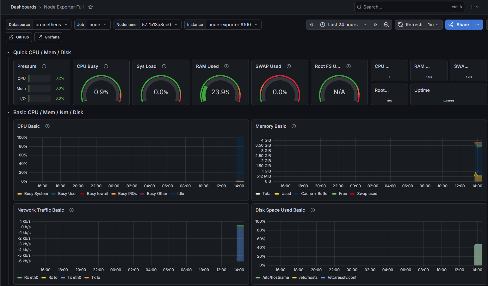
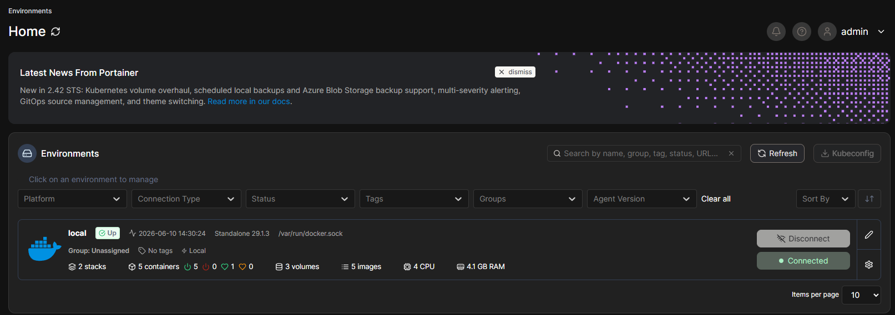
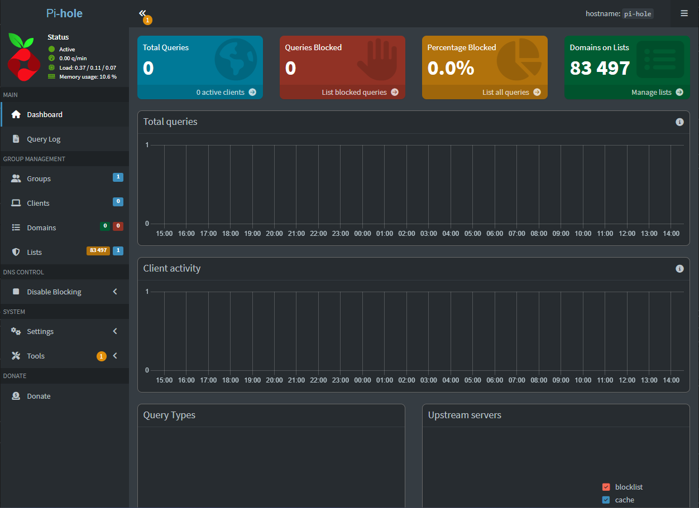
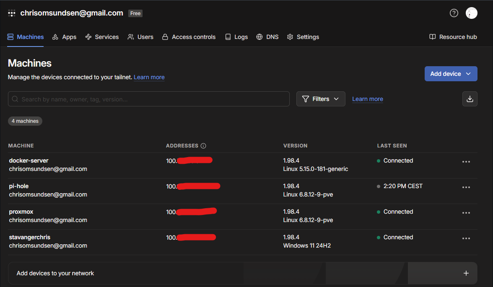

# Homelab Setup

Personal homelab built on an old desktop PC using Proxmox VE to gain hands-on experience with IT infrastructure, networking, system administration, cybersecurity, and DevOps.

---

## Hardware

| Component | Spec |
|-----------|------|
| CPU | Intel i7-4770 |
| RAM | 16GB DDR3 |
| GPU | GTX 950 (unused) |
| SSD | 512GB (OS) |
| HDD | 1TB (storage) |

---

## Network

| Device | Local IP | Tailscale IP | Notes |
|--------|----------|--------------|-------|
| Router/Gateway | `192.168.10.1` | — | |
| Proxmox Host | `192.168.10.200` | `100.x.x.x` | Static IP, Ethernet |
| Ubuntu Docker VM | `192.168.10.119` | `100.x.x.x` | Main Docker host |
| Pi-hole LXC | `192.168.10.100` | `100.x.x.x` | DNS server |

---

## Infrastructure

### Proxmox VE
- **Type:** Type 1 Hypervisor (bare metal)
- **Version:** 8.4.0
- **Web UI:** `https://192.168.10.200:8006`
- **Remote:** `https://100.x.x.x:8006`
- **Network interface:** `enp3s0` (Ethernet)

### Ubuntu Server VM (`ubuntu-docker`)
- **OS:** Ubuntu Server 22.04 LTS
- **vCPUs:** 4
- **RAM:** 4GB
- **Disk:** 50GB
- **Local IP:** `192.168.10.119`
- **Tailscale IP:** `100.x.x.x`

### Pi-hole LXC Container
- **OS:** Debian 12
- **vCPUs:** 1
- **RAM:** 512MB
- **Disk:** 4GB
- **Local IP:** `192.168.10.100`
- **Tailscale IP:** `100.x.x.x`

---

## Services

| Service | Local URL | Remote URL | Description |
|---------|-----------|------------|-------------|
| Proxmox | `https://192.168.10.200:8006` | `https://100.x.x.x:8006` | Hypervisor management |
| Portainer | `http://192.168.10.119:9000` | `http://100.x.x.x:9000` | Docker management |
| Grafana | `http://192.168.10.119:3000` | `http://100.x.x.x:3000` | Monitoring dashboards |
| Prometheus | `http://192.168.10.119:9090` | `http://100.x.x.x:9090` | Metrics collection |
| Homepage | `http://192.168.10.119:3001` | `http://100.x.x.x:3001` | Service dashboard |
| Pi-hole | `http://192.168.10.100/admin` | `http://100.x.x.x/admin` | DNS ad blocker |

---

## Screenshots

### Proxmox — Hypervisor


### Homepage — Service Dashboard


### Grafana — Monitoring Dashboard


### Portainer — Docker Management


### Pi-hole — DNS Ad Blocker


### Tailscale — Remote Access


---
 
## Repository Structure
 
```
homelab/
├── README.md
├── screenshots/
├── monitoring/
│   ├── docker-compose.yml
│   └── prometheus.yml
├── homepage/
│   ├── docker-compose.yml
│   └── config/
│       └── services.yaml
└── pi-hole/
    └── unbound/
        └── pi-hole.conf
```
 
---
 
## Remote Access
 
**Tailscale** is installed on Proxmox, the Ubuntu Docker VM, and the Pi-hole LXC container. This allows secure remote access from anywhere without port forwarding or exposing ports to the internet.
 
---
 
## Pi-hole + Unbound
 
Pi-hole runs as an LXC container on Proxmox and handles network-wide DNS ad blocking. It is configured to use **Unbound** as a local recursive DNS resolver instead of a third-party DNS provider like Google or Cloudflare.
 
This means DNS queries are resolved directly against the root DNS servers — no third party sees your DNS traffic.
 
Config file: [`pi-hole/unbound/pi-hole.conf`](pi-hole/unbound/pi-hole.conf)
 
---
 
## Planned
 
- [ ] Nextcloud — self-hosted cloud storage
- [ ] Nginx Proxy Manager — reverse proxy with domain names
- [ ] MikroTik hEX router — VLAN and routing practice
- [ ] Proxmox Backup Server — second PC for automated backups
- [ ] Proxmox host metrics in Grafana
---
 
## Skills Demonstrated
 
- Type 1 hypervisor setup and management (Proxmox VE)
- Virtual machine provisioning and configuration
- LXC container management
- Linux server administration (Ubuntu Server, Debian)
- Containerization (Docker, Docker Compose)
- Infrastructure monitoring (Grafana, Prometheus, Node Exporter)
- DNS management and network-wide ad blocking (Pi-hole)
- Local recursive DNS resolution (Unbound)
- VPN and secure remote access (Tailscale)
- Networking fundamentals (static IPs, subnetting, DNS, gateways)
