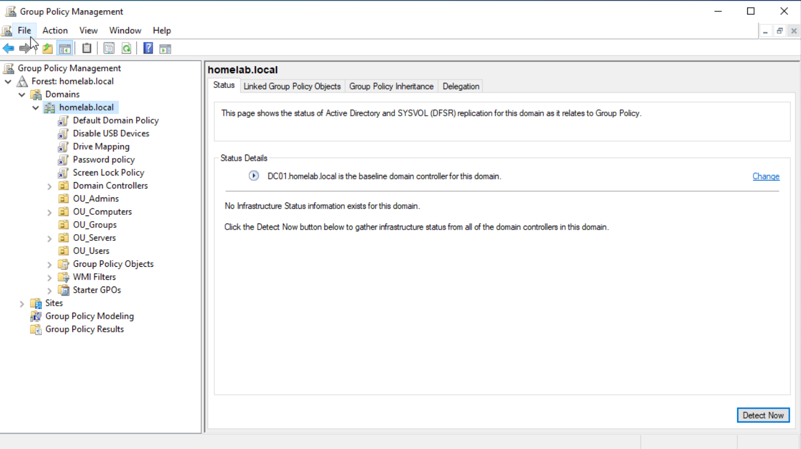
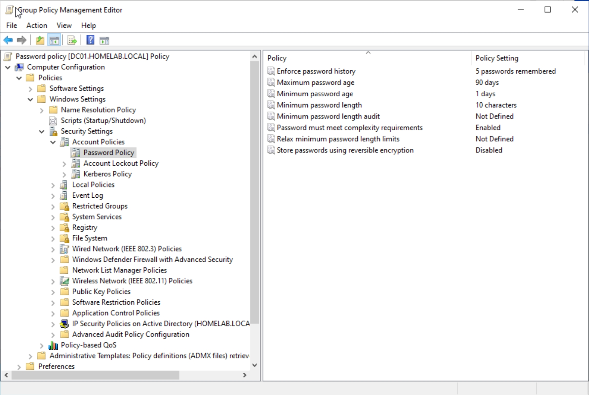
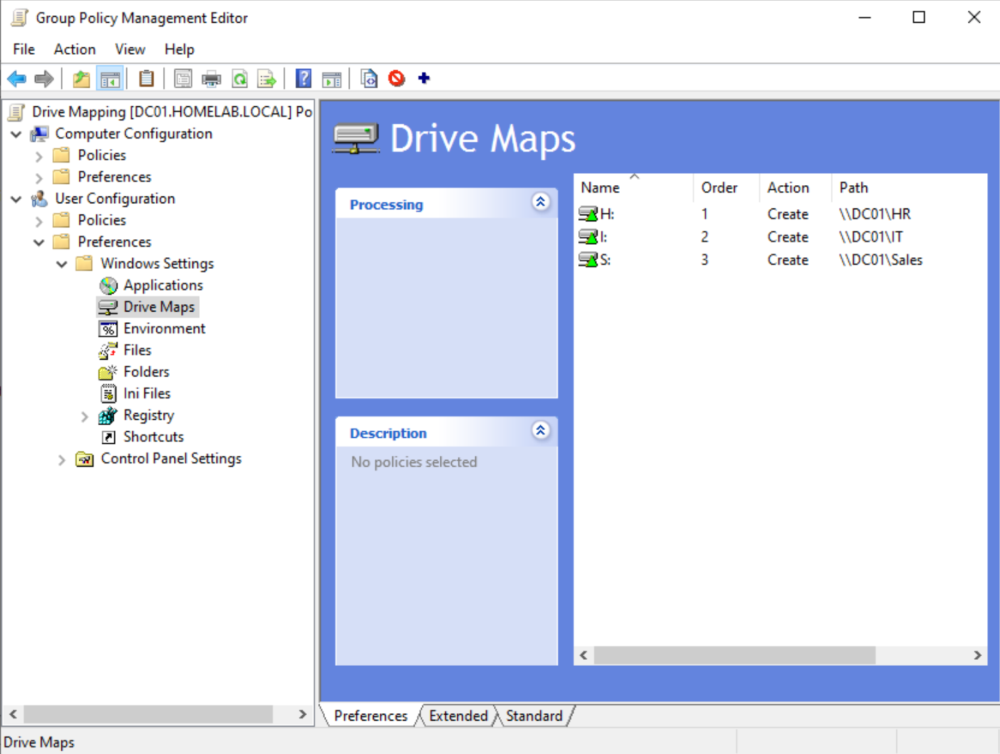
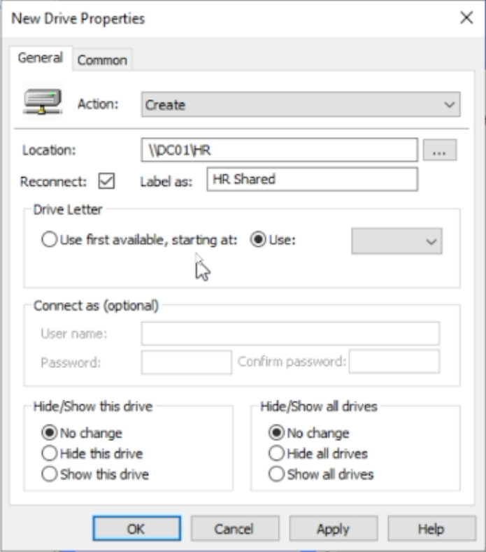
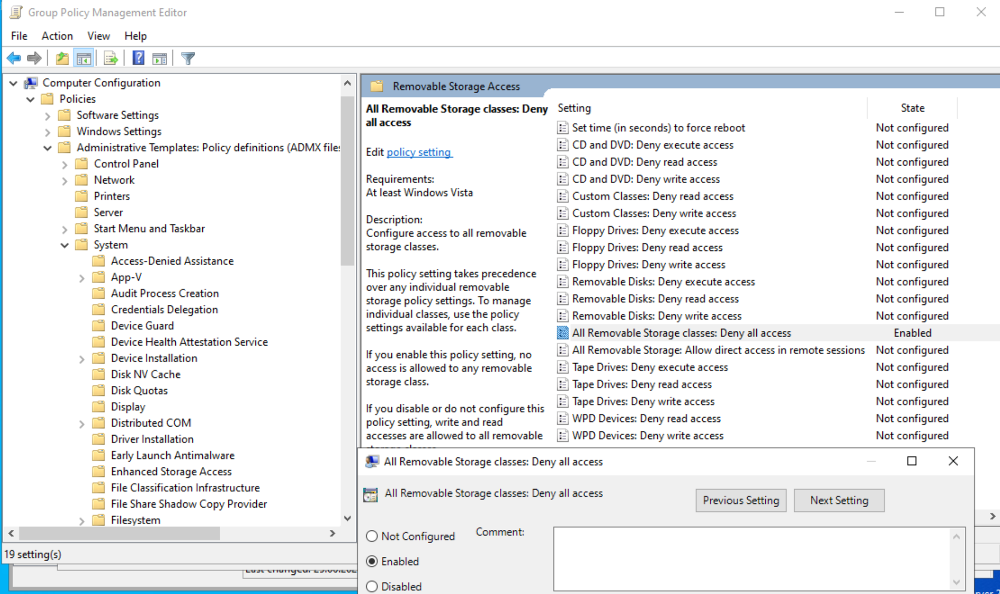
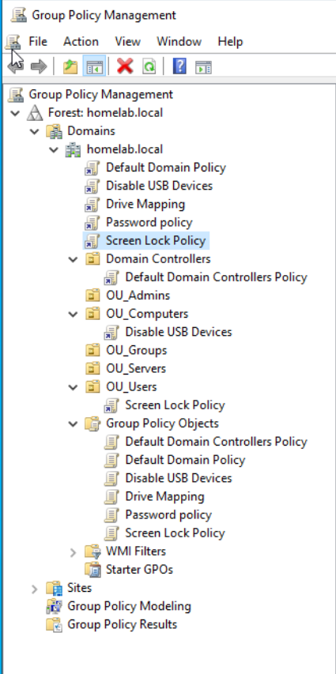
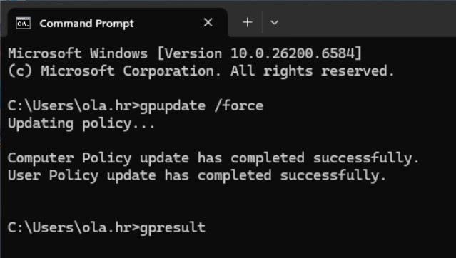

# 03 - Group Policy

## Overview

This section documents the Group Policy Objects implemented in the Active Directory homelab.

Group Policy was used to centrally manage security and user experience settings for domain users and computers.

---

## Implemented GPOs

| GPO | Type | Purpose |
|---|---|---|
| Password Policy | Computer / Domain | Enforce password requirements |
| Screen Lock Policy | User | Lock inactive sessions |
| Drive Mapping | User Preference | Map department network drives |
| Disable USB Devices | Computer | Block removable storage |

---

## GPO Overview



---

## Password Policy

Configured password requirements:

| Setting | Value |
|---|---|
| Password history | 5 passwords remembered |
| Maximum password age | 90 days |
| Minimum password age | 1 day |
| Minimum password length | 10 characters |
| Complexity requirements | Enabled |
| Reversible encryption | Disabled |



---

## Drive Mapping

Drive mapping was configured using:

```text
User Configuration
└── Preferences
    └── Windows Settings
        └── Drive Maps
```

### Drive Mapping Table

| Group | Drive | Path |
|---|---|---|
| HR_Users | H: | `\\DC01\HR` |
| IT_Users | I: | `\\DC01\IT` |
| Sales_Users | S: | `\\DC01\Sales` |





### Validation

Logged in as `ola.hr` and confirmed only the HR drive was mapped.


---

## USB Storage Restriction

Configured under:

```text
Computer Configuration
└── Policies
    └── Administrative Templates
        └── System
            └── Removable Storage Access
```

Enabled:

```text
All Removable Storage classes: Deny all access
```



---

## GPO Linking

Computer-based GPOs should be linked to `OU_Computers`.

User-based GPOs should be linked to `OU_Users`.



---

## Policy Refresh

Policy refresh was tested using:

```cmd
gpupdate /force
```



---

## Skills Demonstrated

- Group Policy Management
- Group Policy Preferences
- Item-Level Targeting
- Password policy enforcement
- Endpoint restriction policies
- Drive mapping automation
- User and computer policy separation
- Windows client validation
