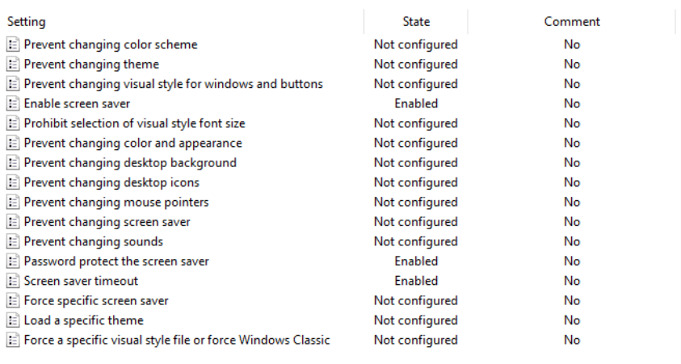

# Screen Lock Policy

## Purpose

Automatically lock inactive user sessions.

## Configuration

Recommended location:

```text
User Configuration
└── Policies
    └── Administrative Templates
        └── Control Panel
            └── Personalization
```

## Screenshot


