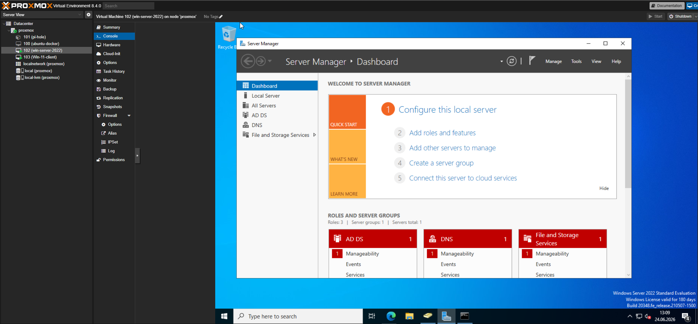
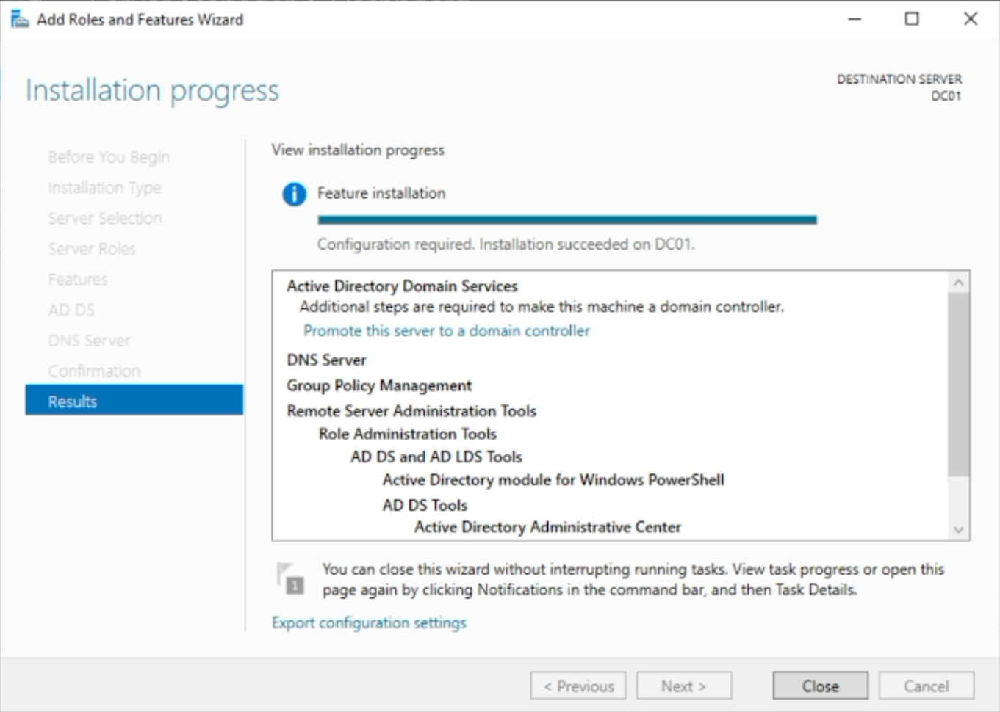
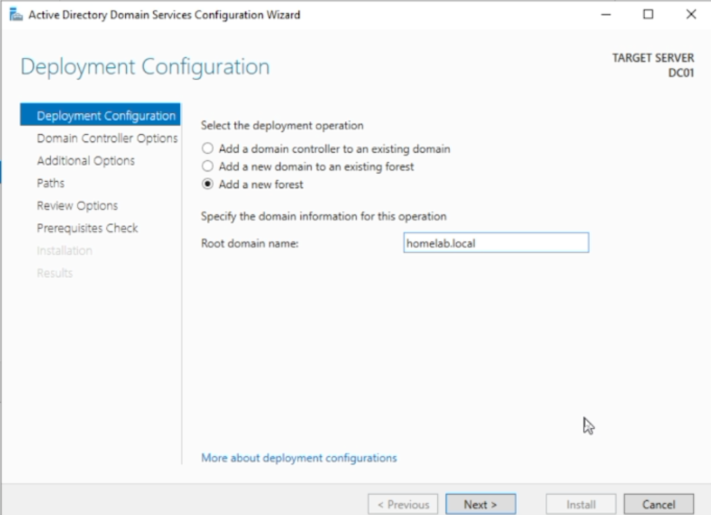
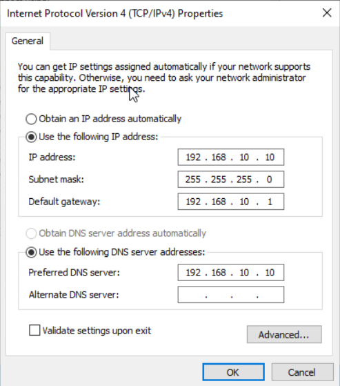
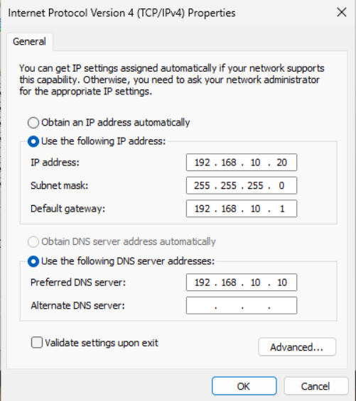
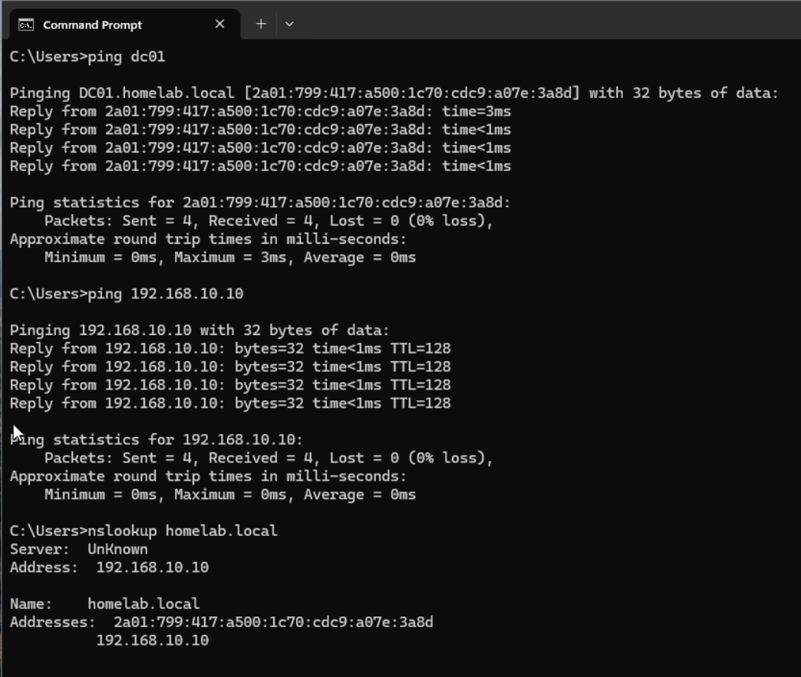
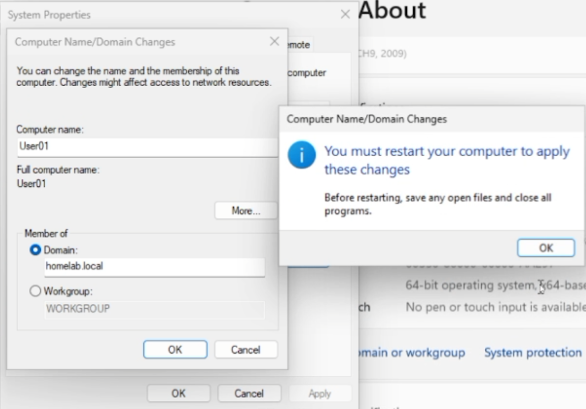
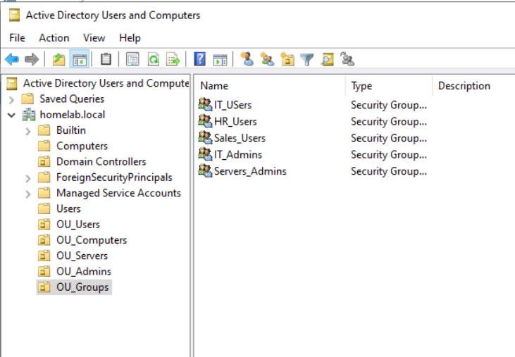
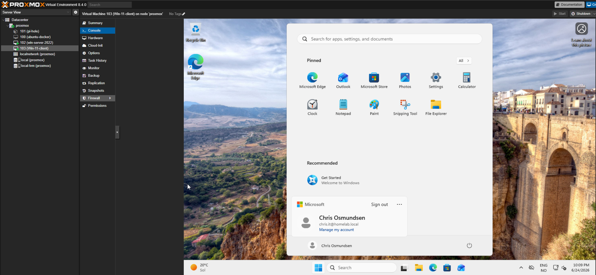

# Active Directory Homelab

## Overview

This project documents a Windows Server 2022 Active Directory lab built in Proxmox.

The goal is to learn how Active Directory works in a realistic small business environment, including domain services, DNS, users, groups, organizational units, domain-joined clients, and Group Policy.

---

## Objectives

- Install and configure Windows Server 2022 as a Domain Controller
- Create an Active Directory domain
- Configure DNS for domain resolution
- Create Organizational Units (OUs)
- Create users and security groups
- Assign users to groups based on roles
- Join a Windows 11 client to the domain
- Test domain login
- Configure and test Group Policy Objects (GPOs)

---

## Lab Environment

| Machine | Role | IP Address | Notes |
|---------|------|-----------|-------|
| DC01 | Domain Controller / DNS | 192.168.10.10 | Windows Server 2022 |
| User01 | Domain Client | 192.168.10.20 | Windows 11 |
| Router | Gateway | 192.168.10.1 | Home network gateway |

Domain:
```
homelab.local
```

---

## Active Directory Structure

```
homelab.local
│
├── OU_Users
│   ├── Chris Olsen
│   ├── Ola Hansen
│   └── Kari Nordmann
│
├── OU_Admins
│   └── Chris Admin
│
├── OU_Groups
│   ├── IT_Users
│   ├── HR_Users
│   ├── Sales_Users
│   ├── IT_Admins
│   └── Servers_Users
│
├── OU_Computers
│   └── User01
│
└── OU_Servers
```

---

## Users

| Name | Username | Role |
|------|----------|------|
| Chris Olsen | chris.it | IT user |
| Ola Hansen | ola.hr | HR user |
| Kari Nordmann | kari.sales | Sales user |
| Chris Admin | cadmin | Admin account |

---

## Security Groups

| Group | Purpose |
|-------|---------|
| IT_Users | Standard IT users |
| HR_Users | HR department users |
| Sales_Users | Sales department users |
| IT_Admins | IT administrator accounts |
| Servers_Users | Server-related access testing |

---

## Group Memberships

| User | Group |
|------|-------|
| chris.it | IT_Users |
| ola.hr | HR_Users |
| kari.sales | Sales_Users |
| cadmin | IT_Admins |

---

## Screenshots

### Proxmox — Windows Server 2022 VM (DC01)


### AD DS Installation


### Domain Creation (homelab.local)


### DC01 IP Configuration


### User01 IP Configuration


### DNS Confirmation (ping dc01 + nslookup homelab.local)


### Domain Join


### OU Structure and Security Groups


### Domain User Login (chris.it@homelab.local)


---

## Documentation

1. [Network Setup](01-setup/01-network-setup.md)
2. [Domain Controller Setup](02-domain-controller/02-domain-controller.md)
3. [Users, Groups and OUs](03-users-groups-ou/03-users-groups-ou.md)
4. [Client Domain Join](04-client-join/04-client-domain-join.md)
5. [Group Policy](05-group-policy/05-group-policy.md)
6. [PowerShell Scripts](scripts/README.md)

---

## Tools Used

- Proxmox VE
- Windows Server 2022
- Windows 11
- Active Directory Domain Services
- DNS Manager
- Active Directory Users and Computers
- Group Policy Management
- PowerShell
