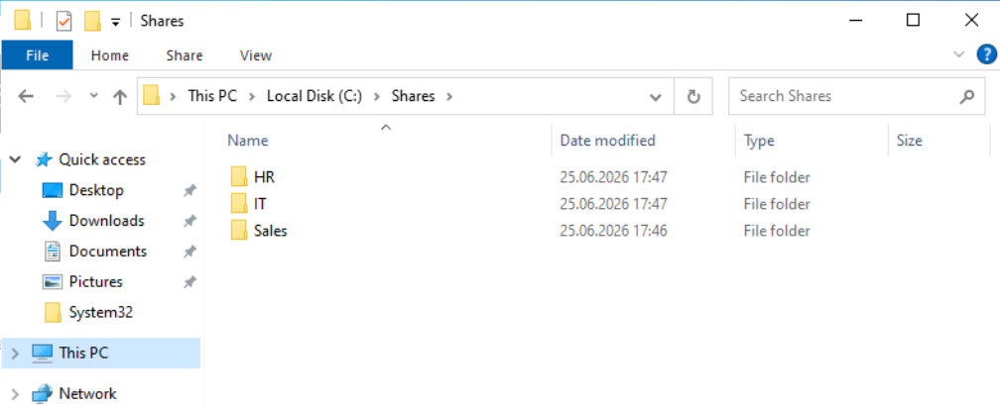
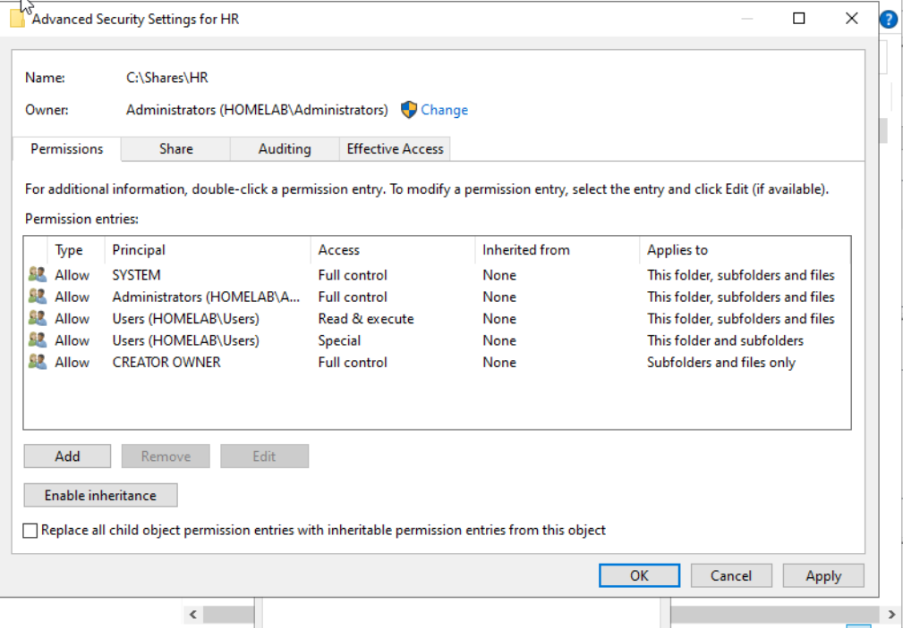
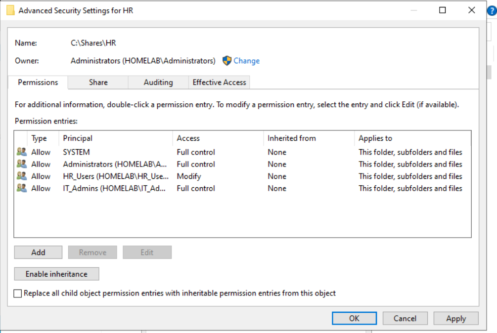
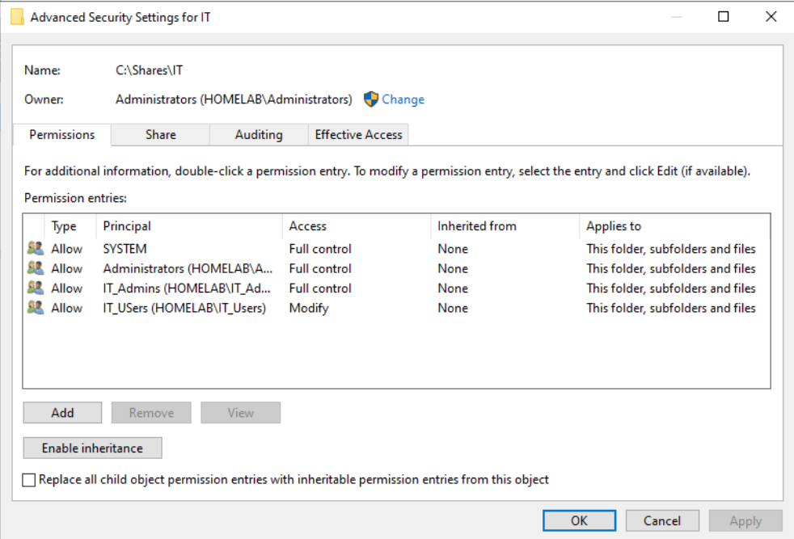
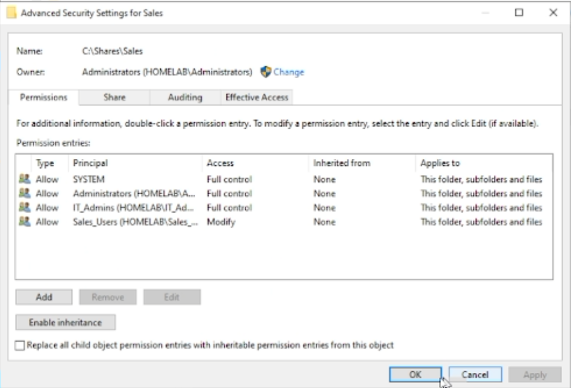

# 02 - File Shares

## Overview

This section documents department file shares created on `DC01`.

The goal was to create realistic SMB shares and control access using Active Directory security groups and NTFS permissions.

---

## Folder Structure

```text
C:\Shares
├── HR
├── IT
└── Sales
```



---

## SMB Shares

| Department | UNC Path |
|---|---|
| HR | `\\DC01\HR` |
| IT | `\\DC01\IT` |
| Sales | `\\DC01\Sales` |

---

## NTFS Permission Model

Access is controlled with AD security groups.

### HR Share

| Principal | Permission |
|---|---|
| SYSTEM | Full Control |
| Administrators | Full Control |
| IT_Admins | Full Control |
| HR_Users | Modify |

### IT Share

| Principal | Permission |
|---|---|
| SYSTEM | Full Control |
| Administrators | Full Control |
| IT_Admins | Full Control |
| IT_Users | Modify |

### Sales Share

| Principal | Permission |
|---|---|
| SYSTEM | Full Control |
| Administrators | Full Control |
| IT_Admins | Full Control |
| Sales_Users | Modify |

---

## Implementation Screenshots

### HR Permissions Before Cleanup



### HR Permissions After Cleanup



### IT Permissions



### Sales Permissions



---

## Validation

The shares were validated by logging into the Windows 11 domain client as different users.

Example:

- `ola.hr` receives access to HR resources.
- `ola.hr` should not access IT or Sales resources.
- `IT_Admins` has Full Control across all department shares.

### HR User Drive Result


---

## Skills Demonstrated

- SMB file sharing
- NTFS permissions
- Security group-based access control
- Least privilege
- Windows Server file administration
- Active Directory group management
