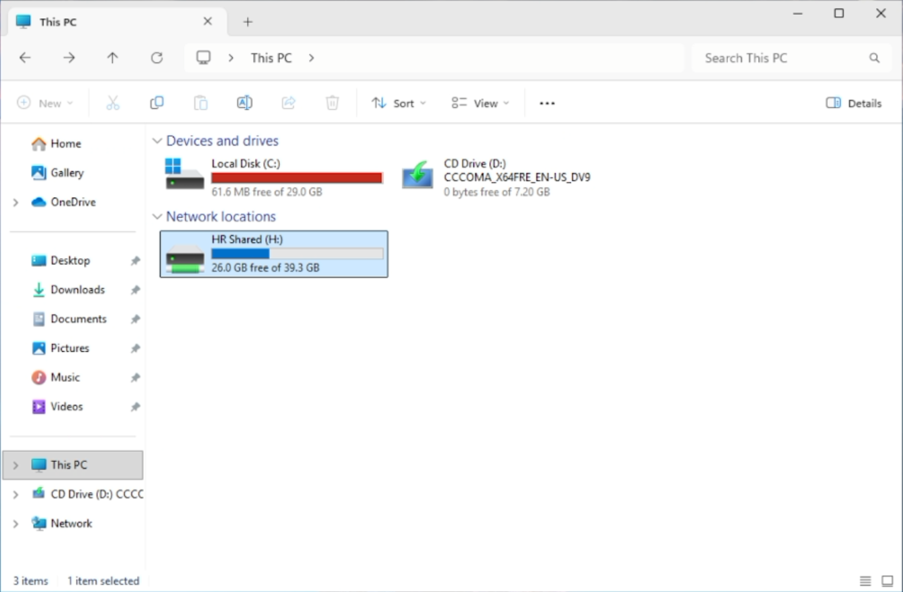

# Drive Mapping

## Purpose

Automatically map department network drives based on Active Directory group membership.

## Configuration

| Group | Drive | Path |
|---|---|---|
| HR_Users | H: | `\\DC01\HR` |
| IT_Users | I: | `\\DC01\IT` |
| Sales_Users | S: | `\\DC01\Sales` |

## Validation

The setup was tested by logging into `User01` as domain users.

- `ola.hr` received H:
- IT users should receive I:
- Sales users should receive S:

## Screenshots




## Missing Screenshot

Add one screenshot of Item-Level Targeting showing:

```text
Security Group = HR_Users
```
