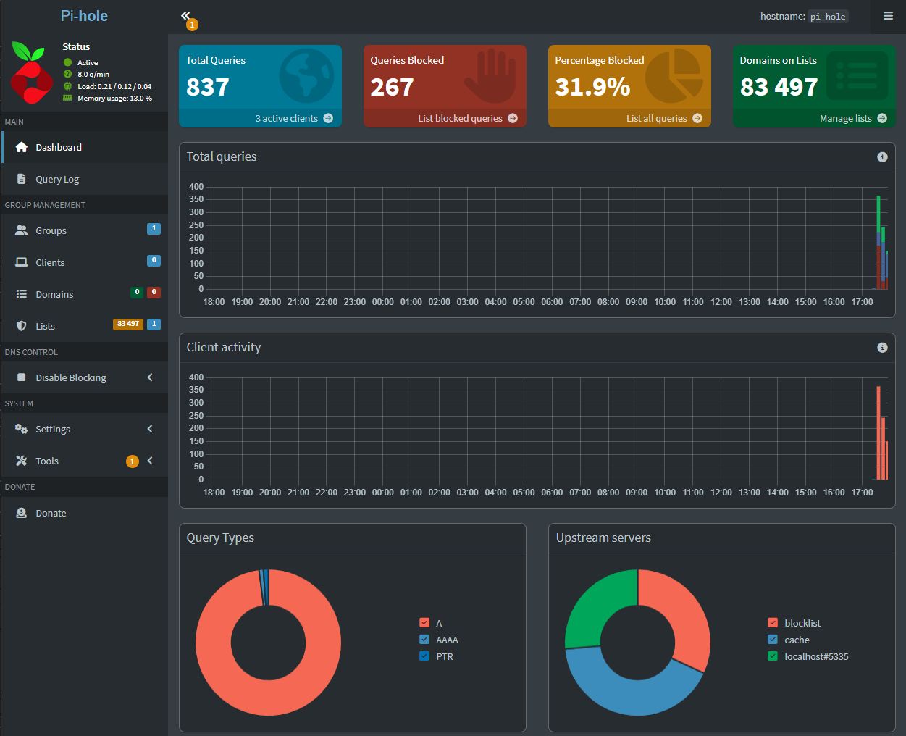
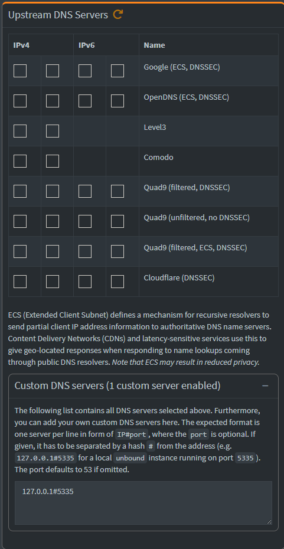
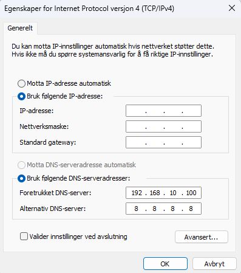

# Pi-hole + Unbound

Network-wide DNS filtering and privacy-focused DNS resolution running in a Debian 12 LXC container on Proxmox.

## Objective

The goal of this project was to:

- Learn how DNS works
- Deploy Pi-hole for network-wide ad blocking
- Configure Unbound as a recursive DNS resolver
- Troubleshoot Linux networking and DNS issues
- Gain experience with self-hosted infrastructure

---

## Architecture

```text
Client Device
      │
      ▼
   Pi-hole
      │
      ▼
   Unbound
      │
      ▼
 Root DNS Servers
```

Instead of forwarding DNS requests to Google DNS or Cloudflare DNS, Unbound resolves DNS queries directly using the DNS hierarchy.

---

## Environment

| Component | Details |
|------------|----------|
| Hypervisor | Proxmox VE |
| Container | Debian 12 LXC |
| DNS Filter | Pi-hole |
| Resolver | Unbound |

---

## Deployment Process

### 1. Create Pi-hole LXC

Created a Debian 12 LXC container in Proxmox and installed Pi-hole.

### 2. Install Unbound

```bash
apt update
apt install unbound -y
```

### 3. DNS Troubleshooting

During installation the container could not resolve external domains:

```text
Temporary failure resolving 'deb.debian.org'
```

The issue was caused by incorrect DNS configuration inside the container.

### 4. Configure Unbound

Created:

```text
/etc/unbound/unbound.conf.d/pi-hole.conf
```

Configured:

- DNSSEC validation
- Recursive lookups
- Query prefetching
- Private address protection
- IPv4 and IPv6 support

### 5. Validate Unbound

```bash
dig pi-hole.net @127.0.0.1 -p 5335
```

Result:

```text
status: NOERROR
```

### 6. Configure Pi-hole

Configured Pi-hole to use:

```text
127.0.0.1#5335
```

as the upstream DNS resolver.

### 7. Verify Functionality

DNS resolution:

```bash
dig google.com @192.168.10.100
```

Ad blocking:

```bash
dig doubleclick.net @192.168.10.100
```

Result:

```text
0.0.0.0
```

### 8. Configure Clients

Configured Windows clients to use Pi-hole as the primary DNS server.

Verification:

```powershell
nslookup doubleclick.net
```

Result:

```text
Server: pi.hole
Address: 192.168.10.100

Name: doubleclick.net
Addresses: ::
           0.0.0.0
```

---

## Screenshots

### Pi-hole Dashboard



### DNS Settings






---

## Skills Demonstrated

- DNS administration
- DNS troubleshooting
- Recursive DNS resolution
- DNSSEC
- Linux administration
- Proxmox LXC management
- Network diagnostics
- Self-hosted infrastructure
